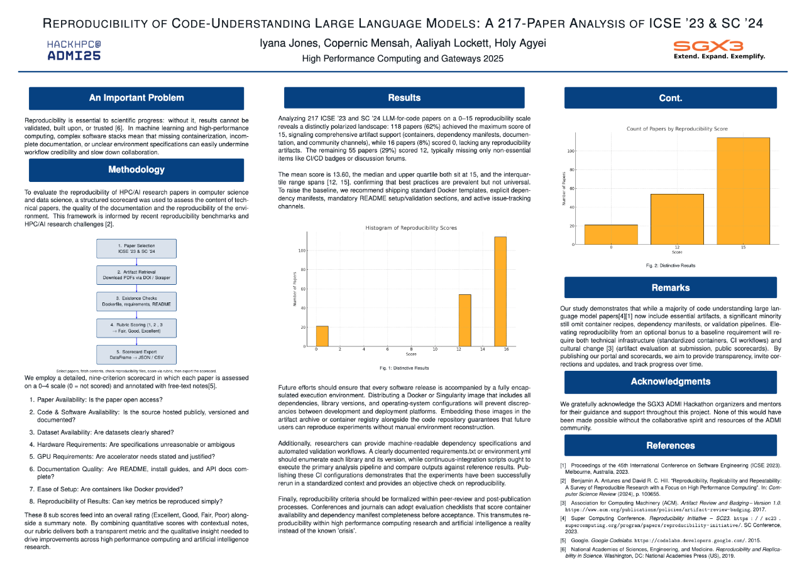

# 🧪 CodeRunners — RealWorldBugs: A Reproducibility Showdown

Welcome to the CodeRunners' submission for HackHPC @ ADMI 2025. This project investigates the **reproducibility and openness of real-world research artifacts** from recent AI and HPC conferences by building and applying an automated scoring system.

🔗 GitHub Repository: [https://github.com/SGX3CodeRunners/RealWorldBugs](https://github.com/SGX3CodeRunners/RealWorldBugs)

---

## 🎯 Project Overview

**Project Name**: A Comprehensive Study of Real-World Bugs in Machine Learning Model Optimization  
**Objective**: Reproduce and evaluate 189 papers’ LLM-based code understanding results.  
**Goal**: Build a central dashboard to track reproducibility status and score trends. Share findings via poster and web portal.

---
## Poster Preview

  

---

## 📅 Key Milestones and Deliverables

| Milestone           | Description                                   | Due Date | Deliverables                            |
|---------------------|-----------------------------------------------|----------|-----------------------------------------|
| Day 1 – Kickoff     | Assign papers, set up repo, define rubric     | ✅       | Team roles, README, paper list          |
| Day 2 – Artifact Setup | Clone/test initial papers                  | ✅       | Logs, notes, environment specs          |
| Day 3 – Scorecard   | Finalize format and score 25–50 papers        | ✅       | Draft dashboard, metrics                |
| Day 4 – Portal Build| Visualize results and polish                  | ✅       | Flask/Streamlit site, poster draft      |
| Day 5 – Final Submit| Finalize and present                          | ✅       | Poster, bio page, submission repo       |

---

## 🧪 Evaluation Framework

### 📌 Reproducibility Criteria

We assess each paper using the following points:

- **Paper Accessibility**  
  Status: `[Accessible / Partially Accessible / Not Accessible]`  
  Notes: Clarity of access, licensing, PDF links.

- **Code Availability & Usability**  
  Status: `[Runnable / With Issues / Not Shared]`  
  Notes: Repo links, licensing, install steps.

- **Data Accessibility**  
  Status: `[Findable / Requires Effort / Not Usable]`  
  Notes: Dataset formats, URLs, preprocessing.

- **First Code Run Attempt**  
  Result: `[Success / Partial / Failed]`  
  Notes: Errors, fixes, missing instructions.

---

## 📊 Reproducibility Scorecard Criteria

Each paper was evaluated using the following **8 reproducibility metrics**, with scores from **0 (not present)** to **2 (fully addressed)** unless otherwise noted.

| Metric                          | Description                                                                 |
|---------------------------------|-----------------------------------------------------------------------------|
| **1. Paper Availability**       | Whether the paper was downloadable and accessible for review.              |
| **2. Availability of Code and Software** | Whether code repositories or software links were included.             |
| **3. Availability of Datasets** | Whether the dataset(s) used in the study were available and referenced.    |
| **4. Computer Requirements**    | Clarity about CPU, RAM, OS, or system dependencies needed to reproduce.    |
| **5. GPU Requirements**         | Clarity about GPU/TPU needs, CUDA versions, or compute capabilities.        |
| **6. Documentation Quality**    | Existence of README, usage instructions, or inline comments.               |
| **7. Ease of Setup**            | How easily a user could install or configure the environment.              |
| **8. Reproducibility of Results** | Whether the paper reports verifiable output, metrics, or comparisons.     |

> **Note**: A ninth category, **Overall Rating**, was manually assigned after reviewing all other scores and reviewer notes.

---

### 🎯 Scoring Scale

- **0** = Not addressed  
- **1** = Mentioned, but incomplete or unclear  
- **2** = Clearly provided and actionable  

---

These criteria reflect the practical challenges of reproducing real-world research artifacts, especially for AI/ML papers involving code, data, and hardware.

---

## ✅ Sample Papers Evaluated
A few sample papers evaluated were: 
- [HistFuzz](https://github.com/CGCL-codes/HistFuzz)
- [CCRep](https://github.com/ZJU-CTAG/CCRep)
- [CodeGenEval (Zenodo)](https://doi.org/10.5281/zenodo.7037673)
- [EXO Paravirtualization](https://github.com/nicexlab/exo)
- [Multicast-Based Allgather](https://github.com/spcl/multicast-based-allgather)

---
## 👥 Meet the Team

| Name        | Role                    | GitHub                                      | LinkedIn                                      | Photo Preview                         |
|-------------|-------------------------|----------------------------------------------|-----------------------------------------------|----------------------------------------|
| **Alice Doe**  | Project Lead             | [@alice-doe](https://github.com/alice-doe)      | [linkedin.com/in/alicedoe](https://linkedin.com/in/alicedoe)     |   |
| **Ben Smith**  | Experiment Engineer      | [@bensmith](https://github.com/bensmith)        | [linkedin.com/in/bensmith](https://linkedin.com/in/bensmith)     |     |
| **Chloe Kim**  | Model Analyst            | [@chloekim](https://github.com/chloekim)        | [linkedin.com/in/chloekim](https://linkedin.com/in/chloekim)     |   |
| **David Park** | Portal Developer         | [@davidpark](https://github.com/davidpark)      | [linkedin.com/in/davidpark](https://linkedin.com/in/davidpark)   |   |
| **Ella Ray**   | Poster & Docs Lead       | [@ellaray](https://github.com/ellaray)          | [linkedin.com/in/ellaray](https://linkedin.com/in/ellaray)       |    |

---

## Team Roles

- **Aaliyah:** Experiment Engineer – Sets up tasks and runs model reproductions
- **Arghavan:** Model Analyst – Compares outputs, fills scorecard gaps
- **Holy:** Portal Builder – Develops dashboard and visualization tools
- **Copernic:** Presenter – Creates poster/slide visuals and demos
- **Iyana:** Project Lead – Oversees progress, edits documentation, ensures delivery

---

## Resource Requirements

- **People:** 5 team members with skills in Python, Hugging Face, Git, and Docker
- **Tools:** 
  - GitHub, Google Drive, Streamlit/Flask
  - Google Colab, Kaggle, or cloud GPUs (as needed)
  - Canva or Google Slides for poster
- **Communication:**
  - Slack, Discord, Zoom for check-ins

---

## Daily Check-ins

We hold daily check-ins via [Slack or Zoom] at 10:00 AM, 3:00 PM, and 7:00 PM EST to:

- Report progress
- Discuss blockers
- Assign next-day goals
- Share important discoveries

---

## Risks & Mitigation

| Risk | Mitigation |
|------|------------|
| Papers missing artifacts | Contact authors, note gaps, use similar alternatives |
| Long run times | Run smaller tests, use cloud APIs, reuse partial results |
| Dependency/version conflicts | Use Docker or venv per paper |
| Coordination overload | Assign smaller batches, rotate team focus |
| Poster deadline issues | Submit early drafts, verify formatting ahead of time |

---
## Conclusion

Team CodeRunners is tackling a large-scale, real-world challenge: **evaluating reproducibility across 189 cutting-edge research papers**. Our process is thorough, transparent, and open-source contributing to the larger reproducibility conversation in software engineering and LLM research. Our portal and final poster will serve as a reference for future researchers navigating reproducibility in ML research.

---
## Contribution

We welcome contributors! Team members and external collaborators are encouraged to:

- Conduct reproduction attempts for additional papers.
- Submit new scorecard entries.
- Improve automation or analysis tools.
- Suggest features for the dashboard or portal.

Submit a pull request or open an issue to get involved.
